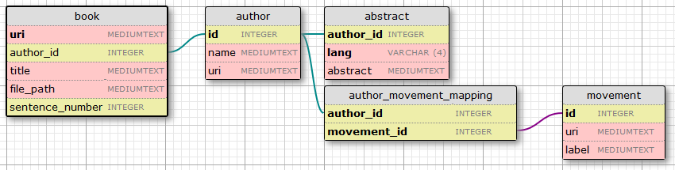

# Data science exam, lab session 1
Extracting and storing text and RDF data.

This README can be found at [https://github.com/EMarquer/data_science](https://github.com/EMarquer/data_science).

## In this README
- [In this README](#in-this-readme)
- [Description](#description)
    - [Exercise 1](#exercise-1)
        - [Author selection criterion](#author-selection-criterion)
    - [Exercise 2](#exercise-2)
    - [Exercise 3](#exercise-3)
- [Setup](#setup)
    - [Built-in Python dependencies](#built-in-python-dependencies)
    - [External dependencies](#external-dependencies)
        - [Spacy models and available languages](#spacy-models-and-available-languages)
- [Usage](#usage)
    - [Description of the effect of each exercise file](#description-of-the-effect-of-each-exercise-file)
        - [`exercise_1.py`](#exercise_1py)
        - [`exercise_2.py`](#exercise_2py)
        - [`exercise_3.py`](#exercise_3py)
    - [Constants](#constants)
- [Files](#files)

## Description
This project was done for the UE803: Data Science of the NLP Master Program of Nancy.
It corresponds to the first of three lab sessions of the evaluation of the UE.

The Lab session is split in three exercises around the extraction of information from the [Gutenberg project](http://www.gutenberg.org/) and the [DBpedia](https://wiki.bdpedia.org/) database.

The code of each exercise is stored in a different file (see [Files](#files)).

### Exercise 1
The first exercise correspond to the extraction of a list of authors and a set of sentences from the books of said authors.

A distribution of `k` authors are selected from the the [Gutenberg project](http://www.gutenberg.org/) author search, according to the first letter of their family name. The distribution of authors among the letters is random.
For each letter, the first authors fulfilling the [author selection criterion](#author-selection-criterion) are selected.

Once the authors and the corresponding books are selected, `n` sentences are chosen per author among the books. The distribution of the sentences among the books of an author is either random (the default behaviour) or balanced (about the same number of sentence per book). The senteces are chosen randomly in each book among the sentences parsed by the Scipy language model.

The selected sentences are stored in TXT files named after the Gutenberg identifier of the book they come from, one sentence per line.
An extra CSV file contains the catalogue of books used, the file where the extracted sentences are stored and the name of the author of the book.

#### Author selection criterion
To be sellected, an author must have at least a certain number of books fullfilling the following conditions:
- the author must be the author of the book;
- the book must not have been chosen for another author (to avoid book duplicates);
- the book must be written in a certain language;
- the book UTF-8 txt transcription must be available without error at an expected URL (structured like `http://www.gutenberg.org/ebooks/<book_ID>.txt.utf-8`).

### Exercise 2
The second exercise correspond to the extraction of information about the authors from either Wikipedia or [DBpedia](https://wiki.bdpedia.org/). We choose the later. 

The exercise can be decomposed into three steps:
1. parsing the name of the author given in the [Gutenberg project](http://www.gutenberg.org/) and finding the corresponding name in [DBpedia](https://wiki.bdpedia.org/);
2. geting the URI of the author;
3. extracting the abstract (in multiple languages) and the literary movement of the author.

This is done using the SPARQL [DBpedia](https://wiki.bdpedia.org/) endpoint.

One can note that it is very rare that the literary movement of minor authors is documented in [DBpedia](https://wiki.bdpedia.org/).

### Exercise 3
The third and last exercise correspond to the agregation of the data extracted using the [exercise 2](#exercise-2) and the book catalogue from the [exercise 1](#exercise-1) into a database.

Here is the structure of the SQL database produced (here the `ebooks/<book_ID>` form the [Gutenberg project](http://www.gutenberg.org/) is used as a book URI):  

## Setup
To use the project, you will need a valid `Python 3.7.1` installation as well as the external libraries described in [External dependencies](#external-dependencies) (check that you have the correct versions!). You will also need to download the correct Spacy language model (see [Spacy models and available languages](#spacy-models-and-available-languages)).

### Built-in Python dependencies
The project relies on the following `Python 3.7.1` built-in libraries:
| Library       |
|---------------|
| re            |
| os            |
| random        |
| collections   |
| pprint        |

### External dependencies
The project uses the following python libraries:
| Library       | Version   |
|---------------|-----------|
| urllib3       | 1.24.1    |
| beautifulsoup4| 4.6.3     |
| spacy         | 2.0.12    |
| numpy         | 1.15.4    |
| pandas        | 0.23.4    |
| SPARQLWrapper | 1.8.2     |
| sqlalchemy    | 1.2.15    |

#### Spacy models and available languages
The `en` model is used by default for spacy.
You can get it by executing `python -m spacy download en` in your terminal.

If you wish to use a different language, you need to download the corresponding model by running `python -m spacy download <lang>` (where `<lang>` is the language key of the language you wish to use).

The available languages are:
|Language   |Language key|
|-----------|----|
|German     |`de`|
|Greek      |`el`|
|English    |`en`|
|Spanish    |`es`|
|French     |`fr`|
|Italian    |`it`|
|Dutch      |`nl`|
|Portuguese |`pt`|

## Usage 
To use the project, you will need the three exercise files from the [repository](https://github.com/EMarquer/data_science).

Each of those files is runable using `python exercise_#.py` (where `#` is the number of the exercise you want to execute).

Also, you can addapt the effects of the project by changing the value of some of the constants listed in [Constants](#constants).

To run the whole project, you need to run `exercise_1.py` then `exercise_3.py`. `exercise_2.py` just provides tools for `exercise_3.py`.

### Description of the effect of each exercise file
#### `exercise_1.py`
This program searches the [Gutenberg project](http://www.gutenberg.org/) for `k` authors and `n` sentences per authors.

The selected sentences are stored in TXT files named after the Gutenberg identifier of the book they come from, one sentence per line (ex: [data/748.txt](data/748.txt)).

An extra CSV file ([data/book_catalogue.csv](data/book_catalogue.csv)) contains the catalogue of books used (title and URI/ebook ID), the file where the extracted sentences are stored and the name of the author of the book.

**Warning**:
- internet connection is required for the program to work;
- running this program will overwrite the previously extracted corpus.

#### `exercise_2.py`
This program searches [DBpedia](https://wiki.bdpedia.org/) for abstracts and literary movement.

Running it just serves to demonstrate that the provided functions work on a predefined example.

#### `exercise_3.py`
This program creates a database from the book catalogue ([data/book_catalogue.csv](data/book_catalogue.csv)) and additional information extracted using `exercise_2.py`.

It produces a SQL database ([data/book_catalogue.db](data/book_catalogue.db)) and tests a set of example requests on this database.

**Warning**:
- running this program will overwrite the previously built database.

### Constants
The constants are stored at the begining of each exercise file. You can change the value of all the constants listed below to adapt the program.
Note that the constants from an exercise may be used in a later exercise.

| Constant | Exercise file | Line | Effect |
|-|-|-|
|VERBOSE| `exercise_1.py` | 19 | If `True`, will make the program describe what is going on during execution. |
|VERBOSE| `exercise_2.py` | 10 | If `True`, will make the program describe what is going on during execution. |
|VERBOSE| `exercise_3.py` | 20 | If `True`, will make the program describe what is going on during execution. |
|AUTHOR_NUMBER| `exercise_1.py` | 23 | Noted `k` in the instruction sheet. The number of authors to extract from the [Gutenberg project](http://www.gutenberg.org/). |
|SENTENCE_PER_AUTHOR| `exercise_1.py` | 24 | Noted `n` in the instruction sheet. The number of sentence to extract per author. |
|ROLE| `exercise_1.py` | 30 | Role of the individual in the book (author, translator, ...). |
|LANGUAGE| `exercise_1.py` | 42 | Language of the book. Must be a language present in the table in [Spacy models and available languages](#spacy-models-and-available-languages). |
|BOOK_THRESHOLD| `exercise_1.py` | 46 | Minimal number of valid books to accept an author. |
|SAVE_PATH| `exercise_1.py` | 57 | Name of the folder in which the TXT and CSV files will be stored |
|CSV_FILE_PATH| `exercise_1.py` | 62 | Name of the CSV catalogue file. |
|CSV_HEADERS| `exercise_1.py` | 63 | Name of the columns in the CSV file. |
|SPARQ_AUTHOR_NAME| `exercise_2.py` | 13 | SPARQL query to get an author URI from their name. |
|SPARQ_MOVEMENTS| `exercise_2.py` | 23 | SPARQL query to get all literary movements (`dbc:Literary_movements`) from an URI. |
|SPARQ_ABSTRACTS| `exercise_2.py` | 36 | SPARQL query to get all abstracts from an URI. |
|DB_PATH| `exercise_3.py` | 21 | Name of the SQL database file. |
|MODE| `exercise_3.py` | 24 | Script mode, in `populate` mode will populate the database, in `test` mode will test a few qyeries. |

## Files
Here is a list of files and a brief description for each of them:
- `data\*.txt`: `*` being the Gutenberg identifier of a book, file containg the sentences from the book;
- `data\book_catalogue.csv`: CSV catalogue of books used, containing:
    - the name of the author of the book in Gutenberg;
    - the title;
    - the URI/ebook ID in Gutenberg;
    - the path to the file where the extracted sentences are stored;
- `data\book_catalogue.db`: SQL database containing information about the books and the authors (see [sql_graph.png](sql_graph.png) for the structure of the database);
- `data_management.py`: file containing a few function to load the data produce by exercise 1 and 3;
- `exercise_1.py`: file containing the functions used to solve the exercise 1;
- `exercise_2.py`: file containing the functions used to solve the exercise 2;
- `exercise_3.py`: file containing the functions used to solve the exercise 3;
- `README.md`: this file, containing various informations about the project and its files;
- `sql_graph.png`: the structure of the database.